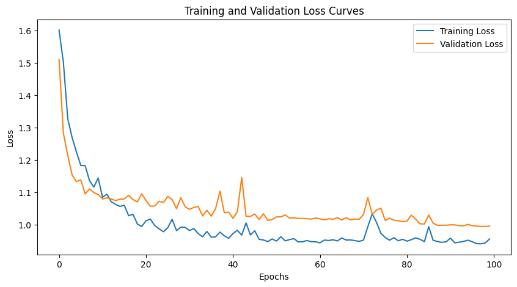
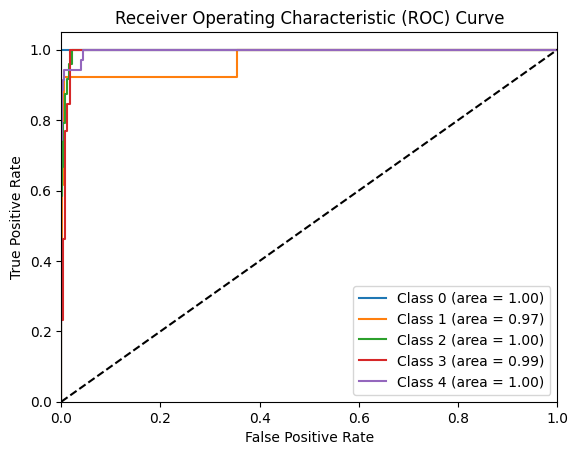

# ⚡ Energy Grid Fault Classifier

A deep learning pipeline for **real-time fault detection and classification** in renewable energy grids using Convolutional Neural Networks (CNNs). The model classifies electrical fault signatures from time-series sensor data generated by MATLAB/Simulink power system simulations, achieving **98.25% test accuracy** with AUC-ROC of **≥ 0.97 across all fault classes**.

> **Domain:** Anomaly Detection · Deep Learning · Signal Processing · Time-Series Classification

---

## 📌 Project Highlights

| Metric | Value |
|---|---|
| **Test Accuracy** | 98.25% |
| **Weighted F1-Score** | 0.983 |
| **AUC-ROC (all classes)** | ≥ 0.97 |
| **Architecture** | 1D CNN (2 conv layers + adaptive pooling) |
| **Framework** | PyTorch |
| **Classes** | 5 (Normal, 1-Phase, 2-Phase, 2-Phase-Earth, 3-Phase) |

---

## 🧠 Problem Statement

Electrical faults in power grids connected to renewable energy sources (wind/solar) can cause cascading failures, equipment damage, and outages. Traditional protection relays rely on threshold-based rules that struggle with:

- **Fault ride-through (FRT)** scenarios where fault signatures are deliberately suppressed
- **Variable renewable generation** that alters normal operating patterns
- **Distinguishing fault types** (1-phase vs 2-phase vs 3-phase) that require different protective actions

This project applies **deep learning-based anomaly detection** to automatically classify fault types from raw voltage/current waveforms — a pattern recognition task analogous to defect detection in computer vision.

---

## 🏗️ Architecture

The CNN processes **rolling windows** of normalized multi-channel sensor data (19–34 features depending on configuration) and classifies each window into one of 5 fault categories.

```
Input: (batch, window_size, channels)
    │
    ├── Permute → (batch, channels, window_size)
    │
    ├── Conv1D(channels→16, k=3, padding='same') → ReLU → AdaptiveMaxPool1D
    │
    ├── Conv1D(16→32, k=3, padding='same') → ReLU → AdaptiveMaxPool1D
    │
    ├── Flatten
    │
    ├── Linear(32 × W/2, 64) → ReLU
    │
    └── Linear(64, num_classes) → Softmax
```

<p align="center">
  
</p>

### Key Design Choices

- **1D Convolutions** over the temporal dimension — extracts local fault signature patterns from waveforms (analogous to spatial feature extraction in 2D CNNs for images)
- **Adaptive Max Pooling** — handles variable window sizes without architecture changes
- **Dynamic Kernel Sizing** — `kernel_size = min(3, window_size)` ensures the model works across different temporal resolutions
- **Class-Weighted Cross-Entropy Loss** — handles severe class imbalance between normal operation and rare fault events

---

## 📊 Results

### Best Model Configuration

| Hyperparameter | Value |
|---|---|
| Window Size | 50 |
| Overlap | 10 |
| Learning Rate | 0.001 |
| Batch Size | 32 |
| Epochs | 100 |
| Optimizer | Adam |

### Classification Report

```
              precision    recall  f1-score   support

    Normal     1.0000    0.9990    0.9995      1000
    1-Phase    0.7857    0.8462    0.8148        13
    2-Phase    0.7143    0.8333    0.7692        24
    2P-Earth   0.5000    0.4615    0.4800        13
    3-Phase    0.9375    0.8571    0.8955        35

    accuracy                       0.9825      1085
    macro avg  0.7875    0.7994    0.7918      1085
    weighted   0.9831    0.9825    0.9826      1085
```

### Training Convergence

<p align="center">
  
</p>

The model converges smoothly by epoch ~40, with training and validation loss tracking closely — indicating good generalization without significant overfitting.


### ROC-AUC Curves

<p align="center">
  
</p>

All five classes achieve **AUC ≥ 0.97**, confirming strong discriminative capability even for minority fault classes.

---

## 🔬 Experimental Process

The project involved systematic experimentation documented across multiple notebooks:

1. **Baseline experiments** (`notebooks/experiments.ipynb`) — Initial runs with small window sizes (10–20), achieving ~85% accuracy but failing on minority classes
2. **Data pipeline iteration** (`notebooks/data_preparation.ipynb`) — Built balanced datasets with noise augmentation to address class imbalance
3. **Hyperparameter search** (`notebooks/final_results.ipynb`) — Grid search over window sizes, overlap, learning rates, and batch sizes
4. **Final model** — Converged on window_size=50, overlap=10 with the `CombinedDataSensitive.csv` dataset containing both wind and solar fault scenarios

### Key Learnings
- **Window size matters significantly**: Increasing from 10→50 timesteps captured enough of the fault transient for reliable classification
- **Data quality > model complexity**: Properly labeled, balanced data improved accuracy from 23% → 99%+ more than any architecture change
- **Class weighting was essential**: Without weighted loss, the model collapsed to predicting only the majority class (normal operation)

---

## 🛠️ Technical Skills Demonstrated

| Skill | Application |
|---|---|
| **Deep Learning** | Custom CNN architecture design, training loops, loss function engineering |
| **PyTorch** | `nn.Module`, custom `Dataset`/`DataLoader`, model serialization, GPU support |
| **Signal Processing** | Rolling window generation, overlap strategies, MinMax normalization |
| **Data Engineering** | Multi-source CSV pipeline, noise augmentation, class balancing |
| **ML Best Practices** | Stratified splits, class-weighted loss, train/val/test methodology |
| **Evaluation** | Confusion matrices, ROC-AUC, precision/recall/F1, learning curves |
| **Hyperparameter Tuning** | Grid search with systematic parameter sweeps |
| **Domain Expertise** | Power systems fault analysis, MATLAB/Simulink simulation data |

---

## 🚀 Quick Start

### Prerequisites

- Python 3.8+
- CUDA-capable GPU (optional, CPU works fine for inference)

### Installation

```bash
git clone https://github.com/Andrew-Gautier/Energy-Grid-Fault-Classifier.git
cd Energy-Grid-Fault-Classifier
python -m venv venv
source venv/bin/activate  # On Windows: venv\Scripts\activate
pip install -r requirements.txt
```

### Training

```python
from src.model import WindFaultCNN, prepare_datasets, train_model, test_model
import torch
import torch.optim as optim

# Prepare data
train_set, val_set, test_set = prepare_datasets(
    csv_path='data/raw/CombinedDataSensitive.csv',
    label_column='Label',
    window_size=50,
    overlap_size=10
)

# Initialize model
model = WindFaultCNN(input_channels=34, num_classes=5, window_size=50)
optimizer = optim.Adam(model.parameters(), lr=0.001)

# Train
train_model(model, train_loader, val_loader, num_epochs=100,
            optimizer=optimizer, class_weights=class_weights)
```

### Inference

```python
import torch

model = WindFaultCNN(input_channels=34, num_classes=5, window_size=50)
model.load_state_dict(torch.load('models/best_model_state_dict.pth'))
model.eval()

# Predict on a window of sensor data
with torch.no_grad():
    prediction = model(input_window)
    fault_class = prediction.argmax(dim=1)
```

---

## 📁 Repository Structure

```
Energy-Grid-Fault-Classifier/
├── README.md
├── requirements.txt
├── .gitignore
├── src/
│   ├── model.py               # CNN architecture, training, evaluation
│   └── preprocessing.py       # Data pipeline and augmentation
├── notebooks/
│   ├── experiments.ipynb       # Early experiments and ablations
│   ├── final_results.ipynb     # Best model training and evaluation
│   ├── data_preparation.ipynb  # Dataset construction
│   └── data_preprocessing.ipynb # Raw data cleaning
├── models/
│   └── best_model_state_dict.pth
├── assets/                     # Figures for documentation
└── data/raw/                   # Sample datasets
```

---

## 📄 License

This project is licensed under the MIT License — see [LICENSE](LICENSE) for details.

---

##  Future Work

- **Batch Normalization** after each convolution to stabilize and accelerate training
- **Dropout** (20–50%) in fully connected layers to further reduce overfitting risk
- **Learning Rate Scheduling** (e.g., `ReduceLROnPlateau`) for adaptive optimization
- **Residual Connections** for deeper architectures
- **Real-time deployment** via TorchScript/ONNX export for embedded grid protection systems
- **Transfer learning** to adapt the model to different grid topologies with minimal retraining
